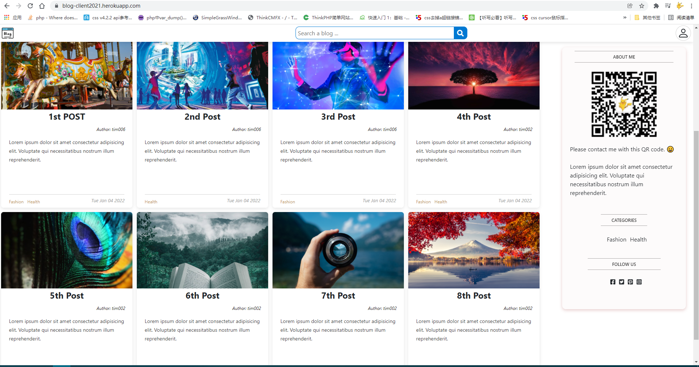
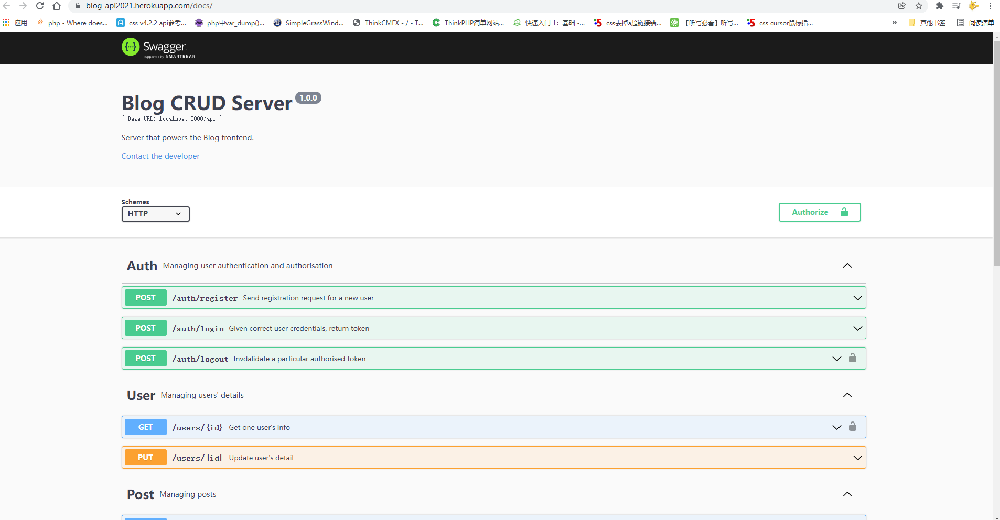

# Blog MERN stack

<!-- Tables -->

| Name     | Email                 |
| :------- | --------------------- |
| Tim Chen | tim20136202@gmail.com |

Client snapshots

Backend snapshots

## Functionality

#### 1. Auth

1.1 Login

1.2 Google Login (need to apply new OAUTH 2.0 client credentials, apply new URIs on the original one don't work)

1.3 Sign up

1.4 Logout

#### 2. User (JWT token)

2.1 Get one user's detail

2.2 Update user's detail

#### 3. Post

3.1 Create a post with image, description, title, categories, timestamps

3.2 View single Post in a detail page

3.3 Delete a single Post

3.4 Update a single Post if user is the creator of the post

#### 4. Categories

4.1 Create categories

4.2 Delete categories if user is the creator if the category

4.3 Update categories

## The things that I have not done

##### 1. Comments section

##### 2. Advertisements sections

##### 3. Search bar (just finish the frontend with static data)

##### 4. UI/UX test (some indicator should be in some section of the webpage)

##### 5. React Test (Jest like that)

##### 6. Pagination/Lazy loading when brunch of posts were created by the users.

## Issues

##### 1. Frontend deployment does not use production:

​	#1 t.map error: useState with array?

​	#2 probably with csdn link of images in the react components

​	#3 remove source maps?

##### 

## What I have learn

##### 1. use express.js build routes, middleware,

##### 2. use multer.js to store image in backend

##### 3. use mongoDB atlas to store database

##### 4. use cors.js to remove CORS error in console

##### 5. React hook:  useContext, useRef, useReducer, useState, useEffect, useMemo
